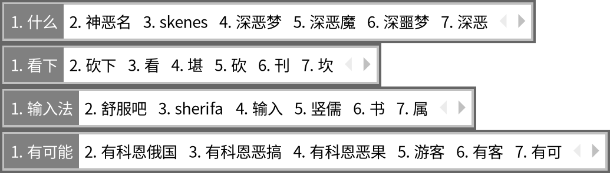

# fcitx5-cloudsecond

**fcitx5 拼音插件：让前两个候选都来自云端（百度）。** fcitx5 自带的云拼音只用百度返回的第一个结果；本插件把百度的第二个结果放在第 2 位，本地候选从第 3 位开始。



（每行第 1 个来自 fcitx5 自带的云拼音，第 2 个来自本插件，第 3 个起是本地候选；最后一行百度只返回了一个结果，所以第 2 个是本地候选。截图是 fcitx5 默认主题在虚拟显示里实际渲染的画面。）

> 这是 fcitx5 的一个**插件**，不是新的输入法，要配合 fcitx5 拼音和它自带的云拼音使用。

[English](#english)

## 为什么做这个

百度云输入能纠正打错的拼音，第二个结果也常常有用：

| 输入 | 第 1 个（fcitx5 云拼音） | 第 2 个（本插件） | 第 3 个起 |
|---|---|---|---|
| `shenem` | 什么 | 神恶名 | 本地候选 |
| `kanxia` | 看下 | 砍下 | 本地候选 |
| `shurufa` | 输入法 | 舒服吧 | 本地候选 |
| `nihaoshenem` | 你搞什么 | 你好什么 | 本地候选 |

（以上是实测截图里的结果，云端结果以百度实际返回为准。百度只返回一个结果时，第 2 位仍是本地候选。）

## 行为

- 等第 1 个云候选出来之后才插入第 2 个。打得快、云结果还没回来就按空格时，上屏的是本地第一个，不会误选云端第二个。
- 云端第二个词如果本地候选里已经有，就把本地那个挪到第 2 位，不重复显示。
- 支持部分选词：先选了一部分（比如"你好"），剩下的拼音同样会补上云端第二个。
- 密码框等敏感输入框里不工作。

## 前提

需要 fcitx5 拼音的云拼音这样设置（fcitx5 设置 → 拼音 / 云拼音）：

- 启用云拼音（`CloudPinyinEnabled=True`）
- 云拼音后端选 **Baidu**
- 云拼音候选位置为 **1**（`CloudPinyinIndex=1`）

**隐私**：输入的拼音会发送给百度。fcitx5 自带的云拼音已经在发；本插件会再单独请求一次，所以每次打字会向百度发两次请求。

## 安装

依赖：fcitx5 拼音（fcitx5-chinese-addons）和它的开发包、libcurl、nlohmann-json、cmake、g++。

已测试的方式（Bazzite / Fedora 44，在 toolbox 里编译）：

```bash
toolbox create fcitx5-build
toolbox run -c fcitx5-build sudo dnf install -y fcitx5-devel fcitx5-chinese-addons-devel libcurl-devel json-devel cmake gcc-c++
git clone https://github.com/GeojoL/fcitx5-cloudsecond.git
cd fcitx5-cloudsecond
./install.sh
```

然后重启 fcitx5（或注销再登录）。插件只往用户目录装两个文件：`~/.local/lib/fcitx5/cloudsecond.so` 和 `~/.local/share/fcitx5/addon/cloudsecond.conf`。

卸载：`./uninstall.sh`，再重启 fcitx5。

## 适用范围

| 环境 | 状态 | 怎么测的 |
|---|---|---|
| Bazzite（Fedora 44）+ fcitx5 5.1.22 + fcitx5 拼音 5.1.14，按上面的「前提」设置 | ✅ | 在隔离的虚拟显示里运行 fcitx5，截图核对候选顺序，并检查上屏结果：选第 2 个、部分选词、快速按空格、和 [fcitx5-multiselector](https://github.com/GeojoL/fcitx5-multiselector) 的网格一起用 |
| 其他发行版、其他云拼音后端、其他候选位置 | 未测试 | |

## 已知限制

- 只支持百度。
- 依赖网络；没网时没有第 2 个云候选，其他候选不受影响。
- 每次打字会多发一次请求（见「前提」里的隐私说明）。

## 相关项目

- [fcitx5-multiselector](https://github.com/GeojoL/fcitx5-multiselector)：按 ↓ 把一行候选展开成 4×8 网格，用方向键选词。两个插件可以同时使用，展开后的网格里前两个同样是云端结果（已实测）。

## 许可证

LGPL-2.1-or-later，与 fcitx5 一致。

## English

**fcitx5-cloudsecond** is a fcitx5 addon for fcitx5 Pinyin. fcitx5's own cloud
pinyin only uses the first result from the cloud backend; this addon asks Baidu
for the same pinyin and puts the second result at position 2, so the first two
candidates come from the cloud and local candidates start from position 3. It
waits until the regular cloud candidate is filled, so a fast Space still commits
the local best guess. Requires cloud pinyin enabled with the Baidu backend and
`CloudPinyinIndex=1`. The typed pinyin is sent to Baidu. Tested on Bazzite
(Fedora 44) with fcitx5 5.1.22; other setups are untested.
